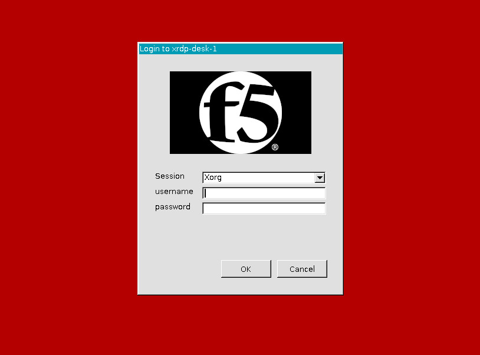

# term-server-desktop

A remote terminal server linux desktop for cloudinit or docker container




## Running term-server-desktop as a Virtual Machine

You can run this as a virtual machines in environment that support standard Ubuntu 20.0.4 minimal images and cloudinit.

The KVM Ubuntu image can be found here:

https://cloud-images.ubuntu.com/focal/current/focal-server-cloudimg-amd64-disk-kvm.img

When booting, use the `user-data` YAML file in this repo as your cloudinit user-data. You can change the `demo` user password in the `user-data` YAML.

If you are using this with a local KVM hypervisor, you can generate an NoCloud data source CDROM ISO by running the `generate-nocloud-ds.sh` a linux workstation with the `genisoimage` utility installed. A default generated ISO, with the default `demo` user password, is included in the repo as `cidata.iso`

You can then access the dekstop on port 3389 of your virtual machines exposed IP address.

## Running term-server-desktop as a Docker container

You can either build a docker image locally:

```bash
git clone https://github.com/jgruberf5/term-server-desktop.git
cd term-server-desktop
docker build --name term-server-desktop:latest .
docker run -d --rm -p 3389:3389 -p 2222:22 term-server-desktop:lastest
```

or use the `jgruberf5/term-server-desktop:latest` image from dockerhub:

```bash
docker run -d --rm -p 3389:3389 -p 2222:22 jgruberf5/term-server-desktop:lastest
```

They connect with your RDP client to `localhost:3389`. The username is `demo` and whatever you set your demo user password to in the Dockerfile. (Hint: default is DEMOPASSWORD).
